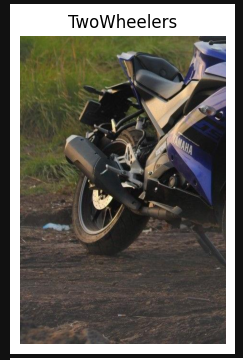
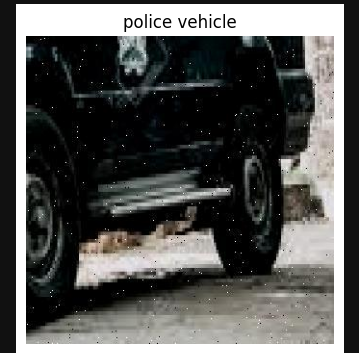
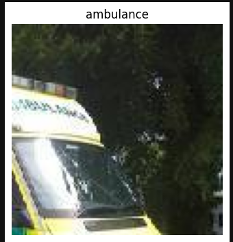
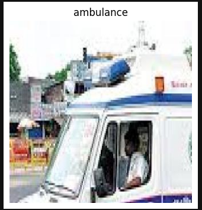
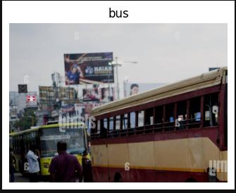

# AI-Traffic-Flow-Optimizer
## 🚨 Emergency Vehicle Detector — End-to-End Project

A end to end project that:
- Takes an **image or video** as input
- Runs **model.pkl** emergency vehicle detector
- Returns **vehicle count**, **density**, and **density per second** (video)

## Project Status
Still Working on some things to make it better 

## Tech Stack
ML: YOLOv8, OpenCV
Backend: FastAPI
Frontend: HTML, CSS, JavaScript
Deployment: Docker

---

## 📁 Project Structure

```
emergency-vehicle-detector/
│
├── notebooks/                          ← Research & experimentation
│   ├── 01_dataset_eda.ipynb            ← Exploratory data analysis
│   ├── 02_model_training_yolov8.ipynb  ← YOLOv8 model training
│   ├── 03_traffic_pipeline.ipynb       ← Traffic detection pipeline
│   └── 04_tracking_and_signal.ipynb    ← Vehicle tracking & signals
│
├── backend/                            ← FastAPI inference server
│   ├── main.py                         ← API routes & logic
│   ├── requirements.txt                ← Python dependencies
│   ├── Dockerfile                      ← Backend container
│   └── model.pkl                       ← Trained YOLOv8 weights
│
├── frontend/                           ← Web dashboard
│   ├── index.html                      ← Main UI
│   ├── style.css                       ← Styling
│   └── script.js                       ← Frontend logic
│
├── main.py                             ← Standalone entry point (local run)
├── requirements.txt                    ← Top-level dependencies
├── docker-compose.yml                  ← Run full stack with one command
└── README.md
```

## Model

- Framework: YOLOv8  
- Task: Multi-class object detection  
- Trained on GPU T4 Google collab  
- Exported model: `model.pkl`

## Model Predictions

Below are sample predictions from the trained model on test images.

| Two Wheeler | Police Vehicle |
|------------|---------------|
|  |  |

| Ambulance | Ambulance |
|-----------|----------|
|  |  |

| Bus |
|-----|
|  |
  
## 🔌Backend API Endpoints

| Method | URL | Input | Output |
|--------|-----|-------|--------|
| POST | `/detect/image` | image file (JPG/PNG) | count, density, confidence |
| POST | `/detect/video` | video file (MP4/AVI) | count, duration, density/sec |
| GET  | `/health`       | — | model status |
| GET  | `/docs`         | — | Swagger UI |


### Example Response (Video):
```json
{
  "total_detections": 5,
  "duration_seconds": 12.4,
  "density_per_second": 0.403,
  "density_label": "Medium",
  "frames_analyzed": 12,
  "message": "Analyzed 12 frames over 12.4s."
}
```

---

## 🧠 How It Works (for learning)

```
User uploads file
       ↓
FastAPI reads the file bytes
       ↓
OpenCV decodes → numpy array (frame)
       ↓
Resize to 224×224 → normalize → flatten
       ↓
model.pkl.predict() → label (0 or 1)
       ↓
Count detections → calculate density
       ↓
Return JSON response
       ↓
Frontend shows results
```


## 📊 Model Stats

| Metric | Score |
|--------|-------|
| Top-1 Accuracy | 85.05% |
| Fitness Score | 92.5% |

## Current Limitations
- Class imbalance affects detection performance
- Limited robustness in dense traffic scenarios
- No object tracking (frame-level detection only)
- Dataset noise (unknown labels) impacts learning

---
## Future work:
### Model & ML
- Improve performance using hyperparameter tuning
- Introduce object tracking (DeepSORT / ByteTrack)
- Handle class imbalance with augmentation and weighting
- Reduce false positives in crowded scenes
### Traffic Intelligence
- Dynamic signal timing based on density
- Lane-level traffic analysis
- Emergency vehicle priority routing
- Real-Time System
- Live CCTV stream integration
- Edge deployment (Jetson / Raspberry Pi)
- Low-latency inference optimization
### Backend & Infrastructure
- Cloud deployment (AWS / GCP)
- CI/CD for model updates
- Model versioning and experiment tracking
- Analytics & Monitoring
- Real-time dashboard
- Logging and monitoring
- Feedback loop for continuous learning
